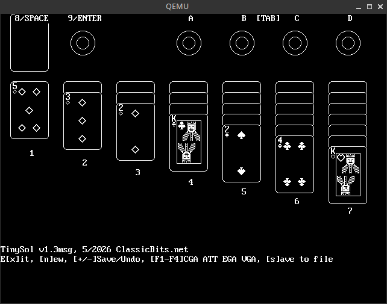

Bootable TinySol
================
This is a *bootable version* of [TinySol][tinysol].



> [!WARNING]
> The *save functionality* has been *stubbed out*, therefore *pressing* the
> *'s' key* will simply result in a *no-op*.
>
> Please *awe a gander* at [src/dos.asm](src/dos.asm#L57) in order to learn
> more about how this was done.

Getting Started
---------------
It will be *easy-peasy-lemon-squeezy* they said! It will be fun, they said!

### Building from source

* NASM (required)
* QEMU (optional, needed for testing)

After installing the dependencies, simply type:

```bash
$ make
$ make iso
```

In order to boot it up in [QEMU][qemu], try the following incantation:

```bash
$ make qemu
```

### Booting from a USB stick or Floppy disk

> [!CAUTION]
> I am not responsible for any direct or indirect data loss or any other damages
> after performing any of the destructive operations presented below.
>
> Consider yourself **WARNED!**

On any \*nix-like system, one can use the following ancient incantation:

```bash
$ dd if=build/TINYSOLB.IMG of=/dev/sdX
```

Where `/dev/sdX` is the target USB stick or floppy disk drive in question.

Please don't destroy your actual HDD in the process. Okay?

M$ W1nd0wz l0s3rs can use a *handy-dandy utility* like [RawWrite32][rawwrite32] instead.

### Booting from CD

Simply burn `build/TINYSOLB.ISO` to a (blank?) CD with your favorite CD burner.

Do people still have one of those, these days? I don't know, and quite honestly
I do not care! **sigh** ...

Contribute
----------

* Fork the project.
* Make your feature addition or bug fix.
* Do **not** bump the version number.
* Create a pull request. Bonus points for topic branches.

License
-------
Copyright (c) 2026, Mihail Szabolcs

**Bootable TinySol** is provided **as-is** under the **MIT** license. For more information see LICENSE.

For additional licensing information be sure to consult the [TinySol][tinysol] manual and homepage.

[tinysol]: https://classicbits.net/coding-and-software/my-software/monosol/
[rawwrite32]: http://www.netbsd.org/~martin/rawrite32/
